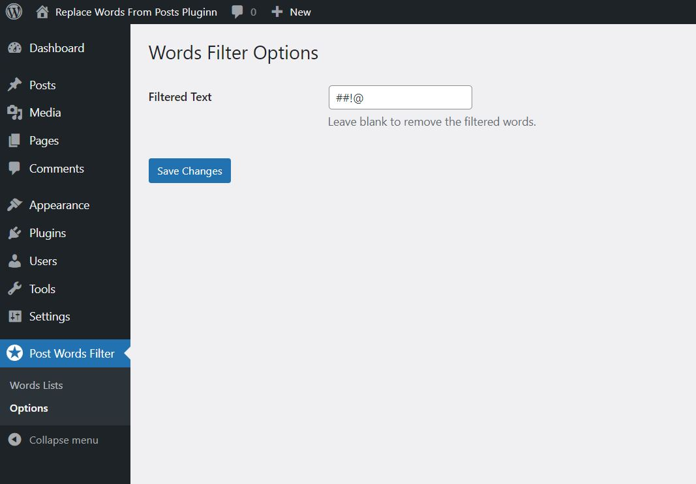

# Post Words Filter

Substitute or change one or more words for other words you have in your posts.

This plugin has only been tested with Wordpress 6.1.1 version.

<strong>Previews</strong>

## How it works

* Type the words in your posts that you want to delete or replace with others.
* Use the filter to customize the output. 

## License

WordPress is free software, and is released under the terms of the GNU General Public License version 2 or (at your option) any later version.
